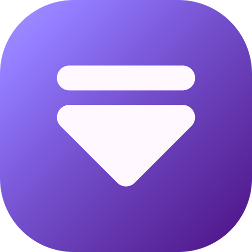

# Spotwrap Next

<p align="center">
  
</p>

## About

Spotwrap Next is a modern desktop application that helps you track and download your favorite music from Spotify. Built with Wails (Go + Vue-TS), it provides a seamless experience for managing your music collection and staying up-to-date with new releases.

## Features

- 🎵 **Artist Tracking**: Subscribe to your favorite artists and get notified when they release new music
- 🔔 **Desktop Notifications**: Receive instant notifications for new releases from your subscribed artists
- ⬇️ **Music Downloads**: Download your favorite tracks directly to your computer
- 🎨 **Modern Interface**: Clean and intuitive user interface built with Vue.js
- 🔄 **Background Updates**: Automatic checking for new releases every 5 hours

## Installation

1. Download the latest release for your platform from the releases page
2. Install the application following your system's standard installation process
3. Set up your Spotify Developer credentials:
   - Go to the [Spotify Developer Dashboard](https://developer.spotify.com/dashboard)
   - Log in with your Spotify account
   - Click "Create App"
   - Fill in the application details:
     - App name: Choose a name (e.g., "Spotwrap Next")
     - Redirect URI: `http://localhost:8080/callback`
     - Description: Optional
   - Once created, you'll see your `Client ID`
   - Click "Show Client Secret" to reveal your `Client Secret`
   - Keep these credentials handy for the next step
4. Launch Spotwrap Next and enter your Spotify Developer credentials when prompted

## Development

### Prerequisites

- Go 1.18 or later
- Node.js 16 or later
- Wails CLI

### Live Development

To run in live development mode:

```bash
wails dev
```

This will start a Vite development server with hot reload for the frontend. You can also access the Go methods through the dev server at http://localhost:34115.

### Building

To create a production build:

```bash
wails build
```

## License

[GPLv3 License](LICENSE)

## Acknowledgments

- Built with [Wails](https://wails.io/)
- Powered by [Spotify Web API](https://developer.spotify.com/documentation/web-api/)
